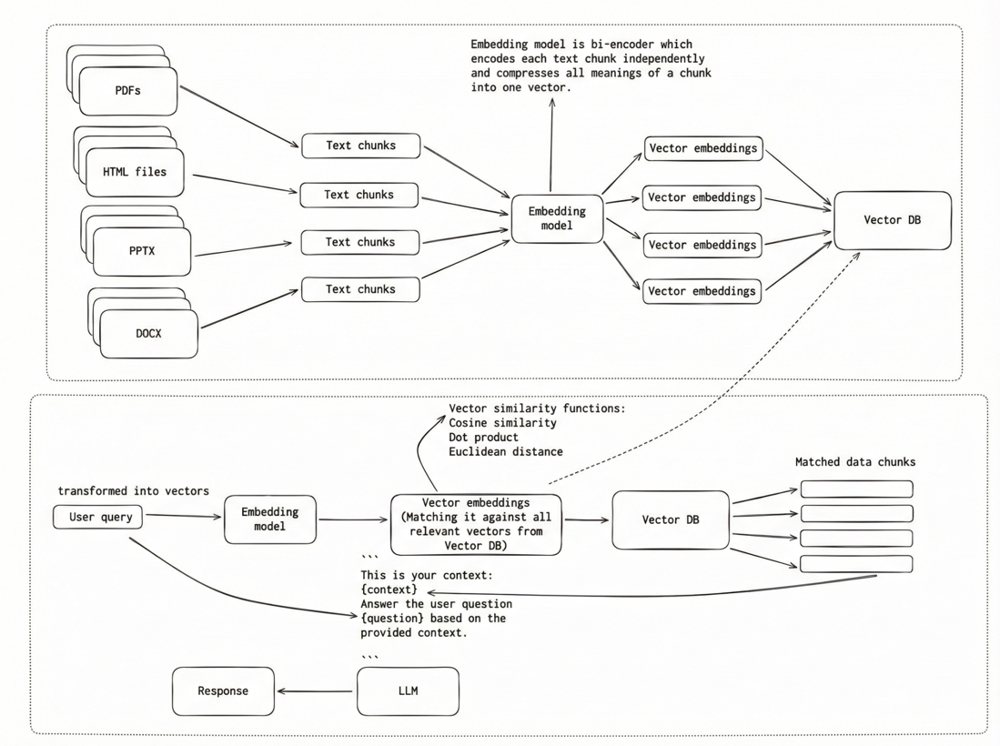

# What Is RAG

## The problem

LLMs have knowledge cutoff dates that prevent them from accessing information or events occurring after their
training period ended.

## RAG (Retrieval-Augmented Generation)

RAG is a technique that addresses the limitation of LLMs not having domain-specific or
up-to-date knowledge by augmenting the model’s responses with relevant information retrieved from an external data source.

This is a traditional RAG system that uses bi-encoders for Indexing (Ingestion Phase) as well as for Retrieval (Query Phase).
To ensure that each vector represents a small, focused piece of information, we split the documents into smaller chunks
and embed them individually. We do this because it is important for the Retrieval Phase, when we have a user query,
the whole document might be relevant overall, but only one paragraph can actually answer the question. We don’t want
LLM to receive too much irrelevant information. After embedding the chunks, we use a Vector Database to store them.
The indexing phase is done offline before any user query exists.

Next, in the Retrieval Phase, we use the same bi-encoder to create a query vector and compare it to all vectors in the
Vector Database. Similarity functions (cosine similarity, dot product, or Euclidean distance) are used to find the most
relevant text chunks. These chunks are then retrieved and passed as context to the LLM to generate the final response.
This phase is online and happens at query time.

There is one problem with this approach, and it’s about information loss that happens because documents 
are embedded without query context.
Ok, but what does “information loss” mean?

Bi-encoder has to produce one vector that “represents all possible meanings” for each text chunk.
This results in a summary of the text chunk in vector form — basically the model guesses what’s important.
Later on when we have the user query, we use the same bi-encoder to create a query vector, and we do similarity search
between the query vector and the other vectors from a Vector database. The search relies purely on vector closeness,
which can be imperfect: some vectors may cover multiple topics, and while they are semantically similar to the query,
they may not contain the most relevant information.

This limitation can be addressed using a cross-encoder, which scores the relevance of a text chunk in the context
of the query. Let’s see how that works in the next post.

## Benefits

- Question answering over private/proprietary data
- Research assistants with up-to-date information
- Any task where the model needs knowledge beyond its training data